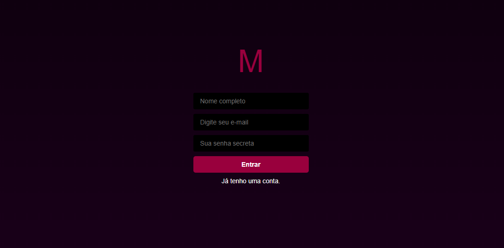
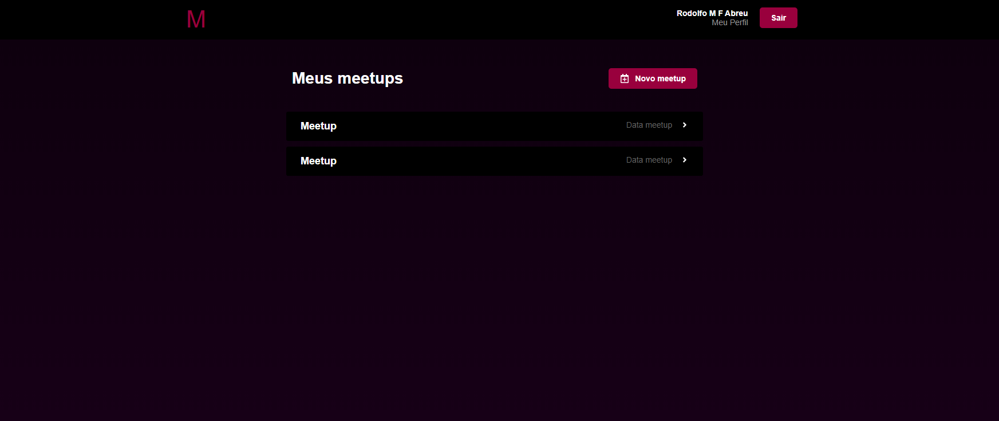
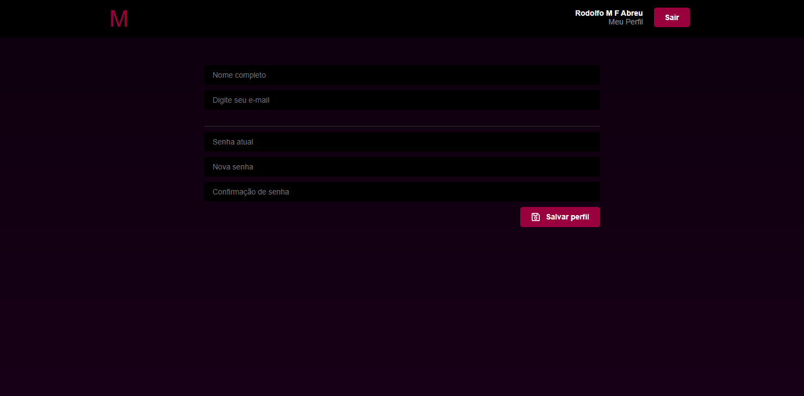

## MEETAPP WEB
### Funcionalidades
- Cadastro de usuários e eventos
- Saga
- Redux
- Redux persistente
- Upload de imagem (cadastro de evento)
- Styled-components
- Autenticação
- Layout padrão para não logado e logado
- Reactotron
- Toastify

### Telas:
- Cadastro

- Login

- Dashboard

- Cadastro de Meetup

- Perfil

#### Não esquecer de configurar o IP do servidor no Axios (./src/Services/api.js)

Rodolfo M. F. Abreu